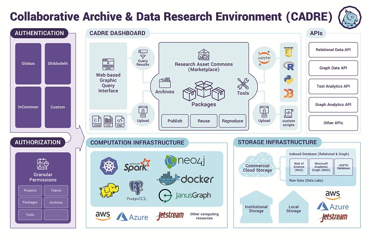

CADRE addresses the IMLS' “National Digital Platform” priority area by addressing a critical emergent issue faced by academic libraries: providing sustainable, affordable, and standardized text- and data-mining services for licensed big datasets, as well as open and non-consumptive datasets, too large or unwieldy to work with in existing research library environments. By sharing costs across a large number of academic libraries, CADRE will create a cloud-based solution for making these data available to its member institutions--with appropriate security, stewardship, and storage--at a fraction of what it would cost them to do alone.

#### > Features ####
* Access major datasets: access Web of Science, Microsoft Academic Graph, and U.S. Patent and Trademark Office data
* Private profile: store query outputs, data-analysis tools, and research results in a profile
* CADRE Query Builder: use this user-friendly GUI query-builder to easily query datasets
* Jupyter Notebook: proficient coders can build data-analysis and visualization tools here
* Marketplace: reproduce queries, tools, derived data, research results, workflows, and visualizations&mdash;and utilize what others share

#### > Partners ####
This platform was built as part of the Shared BigData Gateway for Research Libraries (SBD-G) project, which is made possible by [a two-year IMLS grant](https://www.imls.gov/grants/awarded/lg-70-18-0202-18). The project is led by [Indiana University Libraries](https://libraries.indiana.edu/), in collaboration with the [Indiana University Network Science Institute](https://iuni.iu.edu/) and the [Big Ten Academic Alliance](http://www.btaa.org/). This project is additionally supported by a group of cross-industry partners that you can read more about [here](https://cadre.iu.edu/work-with-us).

#### > Datasets
Our platform is currently seeded with a combination of open and licensed bibliometric datasets, including Microsoft Academic Graph, Web of Science, and U.S. Patent and Trademark Office data. You can learn more about these datasets by visiting the [Available Datasets](https://cadre.iu.edu/about-cadre/available-datasets) page. You can also review documentation for the datsets, as well as our [CADRE Data Access Policy](https://cadre.iu.edu/resources/data-access-policy) on our [Resources page](https://cadre.iu.edu/resources).

#### > Demos & Instructions
If you are a new user trying to learn more about how to work with the platform, visit our [Resources page](https://cadre.iu.edu/resources) to watch informational videos and demos. You will also learn how you can access data as general user and submit stories that will improve the CADRE platform.

#### > Stay Updated
CADRE is moving fast and changing each day. To stay in the loop, subscribe to[ our newsletter](https://cadre.iu.edu/news-and-events) and follow us on Twitter at [@CADRE_Project](https://twitter.com/CADRE_Project).

#### > Diagram ####
