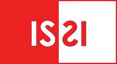

This tutorial will walk users through how to work with the CADRE platform. We will show researchers how to create an account, query Microsoft Academic Graph with our GUI query builder, reproduce work, and more. **Please bring your laptop.**

===

**When:** Monday, Sept. 2, from 16:30 to 18:30  
**Where:** Calasso Room at Sapienza University in Rome, ISSI 2019

For the full ISSI program, including a map of the venue, [click here](https://docs.wixstatic.com/ugd/aa54ce_bcc5f1cb4cc44885985b462e7605333f.pdf).

---

#### CADRE Fellow Presenter ####

##### Yi Bu
Ph.D. candidate in informatics, Indiana University Bloomington  
[Fellowship research project](https://cadre.iu.edu/fellows/understanding-citation-impact-of-scientific-publications-through-ego-centered-citation-networks): "Understanding citation impact of scientific publications through ego-centered citation networks"

---

#### CADRE Project Team Presenters ####

##### Xiaoran Yan
CADRE Project Co-Director  
Research Scientist at Indiana University Network Science Institute. 

##### Valentin Pentchev
CADRE Project Co-Director  
Director of Information Technolgoy at Indiana University Network Science Institute

##### Matthew Hutchinson
Data Manager at Indiana University Network Science Institute

##### Filipi Silva
Research Scientist at Indiana University Network Science Institute

---

#### Tutorial Program ####  
Below is the tutorial itinerary for Monday, Sept. 2. For our workshp program, [click here](https://cadre.iu.edu/news-and-events/events/cadre-workshop).

<table class="table table-striped">
  <thead>
    <tr>
      <th width="20%" scope="col">Time (CEST)</th>
      <th width="80%" scope="col">Description</th>
    </tr>
  </thead>
  <tbody>
    <tr>
      <th scope="row">16:30 - 16:35:</th>
      <td>[Yan] Welcome and introduction to tutorial.</td>
    </tr>
    <tr>
      <th scope="row">16:35 - 16:45:</th>
      <td>[Pentchev] The Promise of CADRE: A brief introduction of the CADRE project, need for collaborative research platforms. Overview of the CADRE design and functionality.</td>
    </tr>
    <tr>
      <th scope="row">16:45 - 16:50:</th>
      <td>[Hutchinson] Walk through registration and set up profile: User registration and Research Commons.</td>
    </tr>
      <tr>
      <th scope="row">16:50 - 17:00:</th>
      <td>[Hutchinson] Demo 1: simple query on the GUI-query builder (step by step using drop-down menus) with simple plotting in notebook.</td>
    </tr>
    <tr>
      <th scope="row">17:00 - 17:05:</th>
      <td>[Hutchinson] Network visualization by running a package with illustrated use of the Research Commons. Refer to Silva for more detailed explanation.</td>
    </tr>
    <tr>
      <th scope="row">17:05 - 17:20:</th>
      <td>[Silva] Demo 2: visualizations and word clouds. Illustrate how we can reproduce with packages and interact with the code in a notebook environment.</td>
    </tr>
        <tr>
      <th scope="row">17:20 - 17:25: </th>
      <td>[Silva] Demo 3: in notebook. Showcase more advanced visualizations.</td>
    </tr>
    <tr>
      <th scope="row">17:25 - 17:35:</th>
      <td>[Pentchev] Free exploration and Q+A 1. Explore CADRE features with drop-down menus and notebooks or individual discussion with the team.</td>
    </tr>
    <tr>
      <th scope="row">17:35 - 17:45:</th>
      <td>[Yan] Introduce CADRE Fellowship Program and contributed projects on MAG data.</td>
    </tr>
       <tr>
      <th scope="row">17:45 - 18:00:</th>
      <td>[Bu] Contributed demos with MAG data on CADRE. It will use a notebook environment on CADRE. Explain research background and technical challenges.</td>
    </tr>
       <tr>
      <th scope="row">18:00 - 18:10</th>
      <td>[Yan] Demo 4: Our solution. In the notebook environment (databricks backend).</td>
    </tr>
      <tr>
      <th scope="row">18:10 - 18:15</th>
      <td>[Yan] Demo 5: with full reproducible pipeline in the notebook environment: https://github.com/iuni-cadre/ReproducibilityDemo</td>
    </tr>
        <tr>
      <th scope="row">18:15 - 18:25</th>
      <td>[Pentchev] Free exploration and Q+A 2. Explore CADRE features with drop-down menus and notebooks or individual discussion with the team, CADRE Fellows.</td>
    </tr>
       <tr>
      <th scope="row">18:25 - 18:30</th>
      <td>[Yan] Regather and conclude the tutorial. Follow CADRE and fellow events on GitHub and Twitter.</td>
    </tr>
  </tbody>
</table>

---

#### Follow along online

CADRE will be Tweeting about our presentation and recording it (to publish in the coming days). To follow our ISSI 2019 CADRE Tutorial online:
* Check out CADRE-ISSI Github: [CADRE ISSI 2019 tutorial](https://github.com/iuni-cadre/cadre/wiki/CADRE-ISSI-2019-tutorial)
* Follow us on Twitter: [@CADRE_Project](https://twitter.com/CADRE_Project)
* Like IUNI on Facebook: [IU Network Science Institute](https://www.facebook.com/iunetsci/)

---

#### Find us at ISSI
Both the CADRE Workshop and Tutorial will be located in the Calasso Room, which is location No. 5 on the map below, or [click here](https://www.issi2019.org/detailed-venue-map) to open the map:

---

#### Background and Rationale ####
Open big bibliometric data sets such as Microsoft Academic Graph (MAG) and the Lens are becoming critical resources for the Scientometrics and Informetrics research community. Open big data sets hold promise for revolutionizing the scientific enterprise when combined with state-of-the-science computational capabilities (Fortunato et al 2018). Yet, this promise cannot be fulfilled on a large scale until barriers are addressed. In particular, the pragmatic constraints of cost and expertise needed to service and support the research infrastructure associated with such large and complex datasets is preventing research groups and institutions from taking advantage of what MAG, the Lens and other large open datasets have to offer. Their user base is limited to the privileged few who has the knowledge and technical support of big data, despite the fact that these open data permits access and sharing with little restrictions. These barriers also make it very difficult for the research community to reproduce, compare, and build upon previous results, hindering scientific progress in Scientometrics and Informetrics.

The proposed cloud-based platform, Collaborative Archive & Data Research Environment (CADRE) aims to provide sustainable, scalable, and standardized data and analytic services for open and proprietary, big data bibliometric data sets. Supported by a U.S. Institute of Museum and Library Services National Leadership Grant and partners in both academia (9 institutions within the Big Ten Academic Alliance) and industry (Web of Science Group and Microsoft Research), CADRE will provide an efficient integrated solution for scholars from different disciplines and institutions, including a free tier that is open to the general public. In addition to providing access to data (per institutional subscription), CADRE is designed to facilitate collaboration and reproducibility by providing a research asset commons, where researchers will be able to save their queries, algorithms, data subsets, derived results, tools and methods. The use of globally unique Digital Object Identifiers (DOIs) will ensure reproducibility and replicability of results as well as data provenance for every stage of their transformation. Another key feature of CADRE will be its flexibility to meet individual researcher’s needs: a graphical user interface with pull down menus will make the platform accessible to researchers with limited programming skills, while application program interfaces and interactive notebook environments will be available for those who are more comfortable writing their own code.

The key for CADRE’s success is to build a community of practice in addition and adjacent to the data cyberinfrastructure. We aim to knit together communities of data providers and consumers, seeking out and cultivating relationships between industry partners, researchers who work with the hosted data, and member libraries. By bringing together this community of stakeholders with a mutual interest, CADRE will help to lower technological and financial barriers, facilitate data and resource sharing across institutional and disciplinary boundaries, promote collaborations and reproducibility, add value to the resource through shared decision making (regarding datasets to add, data custodial tasks, or setting of standards for data, reporting, etc), and ultimately accelerate discoveries in the emerging field of science of science (SofS).

##### The tutorial
At ISSI, we aim to reach out to the international Scientometrics and Informetrics research community. We plan to host an academic workshop in conjunction with a hands-on tutorial. The tutorial will focus on hands-on experience for the general audience at ISSI. Based on CADRE’s free tier and the MAG dataset, it will be fully committed to the "GOTO" principle, which stands for Good, Open, Transparent and Objective, in terms of data, resources and materials.

To address all levels of user proficiency, we will offer two different approaches. A. an intuitive, graphical user interface and B. assisted programming. All attendees will be encouraged to walk through examples using both interfaces. Instructions will be given orally and in writing. The tutorial attendees will have access to step by step instructions as well as individual discussions. They will also have an opportunity to voice their needs and help us better design CADRE through feedback questionnaire. The proposed tutorial is designed to stand alone and also to serve as a perfect complement to our companion workshop on CADRE. Ideally, attendees will register for both the workshop and tutorial to maximize their benefit.

Several months in advance of the tutorial, we will issue a call for SofS researchers to work directly with our development team and to test out the utility of an early version of the CADRE platform for their own use cases. Research projects with great promise of benefitting from CADRE and potential for being of broad interest to the research community, and most importantly, demonstrated commitments to the "GOTO" principle will be selected from the pool of applicants. Moreover, our partner Microsoft Research will provide travel scholarships to the ISSI meeting for these teams, who will showcase their work at the proposed tutorial. For the first time, we will launch CADRE’s free tier service to the international community at ISSI. The system will remain open during the remainder of the ISSI conference, and our scientific and technical team will provide immediate support. The individual discussion section of the tutorial will also serve as the “incubator” for new research ideas on CADRE. Identified ideas and teams will be followed beyond the ISSI conference.

---
#### Sponsors 

 