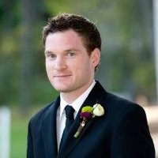
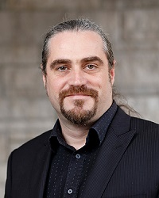

This workshop will introduce CADRE and show SoS researchers how the platform can facilitate collaboration and reproducibility. Attendees will also hear from CADRE Fellows, who will use the platform for their fellowship research projects. 

===
#### Thank you for attending!

---

##### Workshop recording:

[plugin:youtube](https://youtu.be/SORK_OZYjcE)  

---

##### Workshop slides:

* **Patricia Mabry and Xiaoran Yan:** [Welcome and introduction to the team: review of tutorial and preview of workshop’s program.](Patty%20and%20Xiaoran%20slides.pdf)
*  **Valentin Pentchev:** [The Promise of CADRE.](VP%20Workshop-slides-01.pdf)
* **Tim Otto:** Web of Science and CADRE (coming soon).
* **Katy Börner, keynote:** [BIG data for BIG science of science research. The need for CADRE.](https://cadre-website-files.s3.amazonaws.com/19-Borner-ISSI-CADRE.pdf)
* **Michael Park, fellow:** [Changin Characteristics of Innovation.](presentation_MP_20190829v2.pdf)
* **Chao Min, fellow:** [Identifying Citation Patterns of Scientific Breakthroughs.](ISSI%20CADRE%20workshop%20Chao%20Min.pdf)
* **Samuel Hansen, fellow:** [Mathematical Biology and Systematic Mathematical Research Analysis.](issiCADRE%20%28004%29%20Hansen.pdf)

If you need materials for the tutorial, [click here](https://cadre.iu.edu/news-and-events/events/rome).

---

#### Keynote Speaker ####

##### Katy Börner
Victor H. Yngve Professor of Engineering & Information Science at Indiana University Bloomington

---

#### Web of Science Group Presenter 

##### Tim Otto
Senior Business Development Director at Web of Science Group

---

#### CADRE Fellow Presenters ####

##### Michael Park
Ph.D. student in strategic management and entrepreneurship, University of Minnesota  
[Fellowship research project](https://cadre.iu.edu/fellows/measuring-and-modeling-the-dynamics-of-science-using-the-cadre-platform): "Measuring and Modeling the Dynamics of Science Using the CADRE Platform"

##### Chao Min
Research assistant professor in information management, Nanjing University in China  
[Fellowship research project](https://cadre.iu.edu/fellows/understanding-citation-impact-of-scientific-publications-through-ego-centered-citation-networks): "Understanding citation impact of scientific publications through ego-centered citation networks"

##### Samuel Hansen
Mathematics and statistics librarian, Shapiro Science Library, University of Michigan  
[Fellowship research project](https://cadre.iu.edu/fellows/comparative-analysis-of-legacy-and-emerging-journals-in-mathematical-biology): "Comparative analysis of legacy and emerging journals in mathematical biology"  
    [Second research project](https://cadre.iu.edu/fellows/systematic-over-time-study-of-the-similarities-and-differences-in-research-across-mathematics-and-the-sciences): "Systematic over-time study of the similarities and differences in research across mathematics and the sciences"

---

#### CADRE Project Team Presenters ####

##### Patricia Mabry
CADRE Project Co-Director
Research Investigator at Health Partners Institute

##### Xiaoran Yan
CADRE Project Co-Director  
Research Scientist at Indiana University Network Science Institute

##### Valentin Pentchev
CADRE Project Co-Director  
Director of Information Technolgoy at Indiana University Network Science Institute

---
#### Workshop Program ####  
Below is the workshop itinerary for Monday, Sept. 2. Make sure you stick around after our workshop, as our tutorial will be held in the same room, starting at 16:30!

<table class="table table-striped">
  <thead>
    <tr>
      <th width="20%" scope="col">Time (CEST)</th>
      <th width="80%" scope="col">Description</th>
    </tr>
  </thead>
  <tbody>
    <tr>
      <th scope="row">14:00 - 14:10:</th>
      <td>[Mabry] Welcome and introduction to the team: review of tutorial and preview of workshop’s program.</td>
    </tr>
    <tr>
      <th scope="row">14:10 - 14:20:</th>
      <td>[Pentchev] The Promise of CADRE: A brief introduction of the CADRE project, need for collaborative research platforms.</td>
    </tr>
    <tr>
      <th scope="row">14:20 - 14:35:</th>
      <td>[Otto] Web Of Science on CADRE.</td>
    </tr>
      <tr>
      <th scope="row">14:35 - 14:55:</th>
      <td>[Börner] BIG data for BIG science of science research. The need for CADRE. Includes Q+A.</td>
    </tr>
    <tr>
      <th scope="row">14:55 - 15:05:</th>
      <td>[Yan] The CADRE Fellowship Program. Introduce contributed projects teams.</td>
    </tr>
    <tr>
      <th scope="row">15:05 - 15:20:</th>
      <td>[Park (UMN)] Presentation 1: Changing Characteristics of Innovation.</td>
    </tr>
        <tr>
      <th scope="row">15:20 - 15:35:</th>
      <td>[Min (NJU/IU)] Presentation 2: Identifying citation patterns of scientific breakthroughs</td>
    </tr>
    <tr>
      <th scope="row">15:35 - 15:50:</th>
      <td>[Hansen (UMich)] Presentation 3: Mathematical Biology and Systematic Mathematical Research Analysis.</td>
    </tr>
       <tr>
      <th scope="row">15:50 - 16:00:</th>
      <td>[Mabry] Q+A, closing summary, comments on work presented and how it fits in the big picture; briefly outline opportunities.</td>
    </tr>
  </tbody>
</table>

---

#### Follow along online

CADRE will be Tweeting about our presnentation and recording it (to publish in the coming days). To follow our ISSI 2019 CADRE Workshop online:
* Follow us on Twitter: [@CADRE_Project](https://twitter.com/CADRE_Project)
* Like IUNI on Facebook: [IU Network Science Institute](https://www.facebook.com/iunetsci/)

---

#### Find us at ISSI
Both the CADRE Workshop and Tutorial will be located in the Calasso Room, which is location No. 5 on the map below, or [click here](https://www.issi2019.org/detailed-venue-map) to open the map:

---
#### Background and Rationale ####

Big bibliometric data sets such as Web of Science (WoS), and Microsoft Academic Graph (MAG) are of fundamental importance for the Scientometrics and Informetrics research community. Used in conjunction with state-of-the-science computational capabilities, the data hold promise for revolutionizing the scientific enterprise (Fortunato et al 2018). Yet, this promise cannot be fulfilled on a large scale until barriers to use are addressed. In particular, the pragmatic constraints of cost and expertise needed to service and support the data and research resources associated with such large and complex datasets are preventing research groups and institutions from taking advantage of what MAG, WoS and other large datasets have to offer. Moreover, due to the fact that the data use agreements for these datasets in some cases prohibit data/algorithm sharing and collaboration among researchers, it is very difficult for the research community to reproduce, validate, and build upon previous results. These barriers to use and reuse are stifling scientific progress. 

Supported by a U.S. Institute of Museum and Library Services National Leadership Grant, the cloudbased platform, Collaborative Archive & Data Research Environment (CADRE) is a cloud-hosted science gateway that will provide sustainable, scalable, and standardized data and analytic services for open and proprietary, big bibliometric data sets. Additional cost-sharing partners in both academia and industry, CADRE will provide an efficient integrated solution for scholars from different disciplines and institutions, including free access to data in the public domain and associated analytic tools and storage. Access to institutionally-licensed data will be made available to appropriately credentialed individuals via a federated login system. CADRE is designed to facilitate collaboration and reproducibility by providing a Research Asset Commons, where researchers will be able to save their queries, algorithms, data subsets, derived results, tools and methods. 

A critical factor in CADRE’s ultimate success will be to build a community of practice in addition to and adjacent to the data cyberinfrastructure. We aim to knit together communities of data providers and consumers, seeking out and cultivating relationships between industry partners, researchers who work with the hosted data, and member libraries to create a community of stakeholders with a mutual interest in cultivating the utility of CADRE for use by researchers served by academic libraries. 

The workshop will provide an introduction to and rationale for CADRE, including how its use facilitates collaboration and reproducibility directed at science-of-science researchers using big bibliometric data. It will also feature case examples from researchers who have tested a preliminary version of CADRE to address SofS research question(s). Several months in advance of the workshop, we will issue a call for SofS researchers to work directly with our development team and to test out the utility of an early version of the CADRE platform for their own use cases. Selected team will have the opportunity to utilize the initial CADRE platform with access to technical support. Moreover, our partner Web of Science Group will provide travel sponsorships to the ISSI meeting for these teams, who will showcase their work at the proposed workshop. 

The workshop will be CADRE’s formal international debut and we are eager to connect with ISSI attendees, many of whom we hope will be primary beneficiaries of this research platform. Through the workshop, we hope to demonstrate the value of such a sharing platform, to attract a broader engagement of the target users (e.g., SofS researchers, librarians, library science researchers) and to collect feedback on our free service tier, which will be made open to the international community for the first time at ISSI. Please refer to the companion tutorial proposal.

---
#### Sponsors 

  
