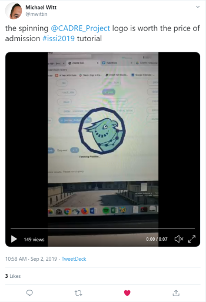
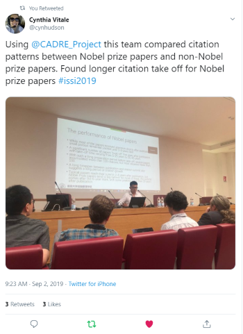
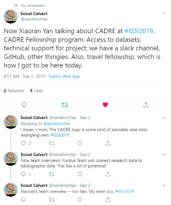

**9/12/19**

Last week, the CADRE team presented our workshop and tutorial at the [2019 International Conference on Scientometrics & Infometrics](https://www.issi2019.org/) (ISSI).

===

Our workshop showed researchers how the platform can benefit science of science research work, including discussions on the importance of big data reproducibility and accessibility. CADRE Fellows [Michael Park](https://cadre.iu.edu/fellows/measuring-and-modeling-the-dynamics-of-science-using-the-cadre-platform), [Chao Min](https://cadre.iu.edu/fellows/understanding-citation-impact-of-scientific-publications-through-ego-centered-citation-networks), and [Samuel Hansen](https://cadre.iu.edu/fellows/systematic-over-time-study-of-the-similarities-and-differences-in-research-across-mathematics-and-the-sciences) all spoke about their research projects and the role CADRE would play in them.

CADRE Fellow [Yi Bu](https://cadre.iu.edu/fellows/understanding-citation-impact-of-scientific-publications-through-ego-centered-citation-networks) spoke at the tutorial, where attendees built a CADRE profile, queried the Microsoft Academic Graph dataset with our GUI query builder, performed analysis with simple code, reproduced their work, and even created a network visualization

If you weren’t at ISSI, there’s still an opportunity to engage with our presentations! You can visit our events pages to look at slides and recordings from both the [workshop](https://cadre.iu.edu/news-and-events/events/cadre-workshop) and the [tutorial](https://cadre.iu.edu/news-and-events/events/rome). 

#### Top tweets
If you want to dive further into the action, you can check out our [Twitter feed](https://twitter.com/CADRE_Project), where the workshop and tutorial were [live tweeted](https://twitter.com/CADRE_Project)--and many attendees joined in. 

CADRE Fellow [Michael Witt](https://cadre.iu.edu/fellows/utilizing-data-citation-for-aggregating-contextualizing-and-engaging-with-research-data-in-stem-education-research) enjoyed our [creative spin](https://twitter.com/mwittin/status/1168538594350383104) on loading logos:  

Attendee Cynthia Vitale [found out how](https://twitter.com/cynhudson/status/1168514717272481792?s=20) CADRE facilitates Nobel-worthy research about Nobel-prize papers:  

Another CADRE Fellow, [Scout Calvert](https://cadre.iu.edu/fellows/mapping-collaborations-and-partnerships-in-sdg-research), wants you to know that being a CADRE Fellow is pretty great--and that [our owl is adorable](https://twitter.com/windloochie/status/1168508342165262337?s=20) . We can’t disagree:  
 

To make sure you don’t miss another exciting event like our presentation at ISSI, [follow us](https://twitter.com/CADRE_Project) on Twitter and [subscribe](https://cadre.iu.edu/news-and-events) to our newsletter.