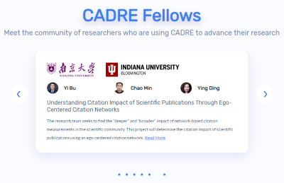

**8/15/19** 

The CADRE team is hard at work developing a platform that will do what academic libraries have long been trying to achieve. 

We are gearing up for [ISSI 2019](https://www.issi2019.org/) in September, where CADRE will hold a workshop and tutorial. Our hands-on [CADRE tutorial](https://cadre.iu.edu/news-and-events/events) at ISSI will offer an option to use assisted programming to access Microsoft Academic Graph (MAG), as well as a second option that will allow access to the dataset using the CADRE Query Builder, which uses a graphical user interface.

But building a platform that allows novice coders to easily query massive datasets with a GUI is a lengthy process of trial and error—and that is only one component of CADRE.

Building CADRE is a complex and fluid task: Along with the Web of Science (WoS) and MAG datasets, CADRE will include U.S. patent and trademark data. And more datasets will be added to the platform as different types of researchers request access.

IUNI Lead Software Engineer [Ben Serrette](https://iuni.iu.edu/about/people/person/ben-serrette) says because of the potential to take on more datasets, software solutions must be as generic and adaptable as possible. Like fitting and refitting the pieces of a complex puzzle that keeps changing shape, the [IUNI IT team](https://iuni.iu.edu/about/people/staff) is solving multi-faceted problems with a flexible approach on an enormous scale.

Find out how they’re doing it below. 

##### Latest updates

* Ruling out what doesn’t work: The IT team narrowed down the many serverless technology options that cloud-computing platform [Amazon Web Services](https://aws.amazon.com/) (AWS) offers by eliminating the ones that don’t fit the bill in terms of cost or ability to interface with other CADRE technical components.
* Designing fundamental cloud architecture: CADRE's infrastructure of cloud-based virtual machines and AWS services has been developed.
* Integrating [Jupyter Notebooks](https://jupyter.org/) & file storage: Advanced users can write their own code to create data-analysis tools in CADRE’s notebook. Jupyter Notebooks is up and running with a working file system for storing code.
* Testing the query builder: One service essential to CADRE is the GUI users can use to easily query massive datasets. The IT team is testing the combined powers of a relational database and various graph databases with MAG data to create a more efficient query-builder. 
* Building CADRE’s website: The IT team is finishing the front-end of some pages of the CADRE website, including the homepage and the event page for ISSI 2019. They are preparing to make the website live in a couple weeks.

If you want to stay updated on what CADRE is doing, be sure to [follow us on Twitter](https://twitter.com/CADRE_Project).

